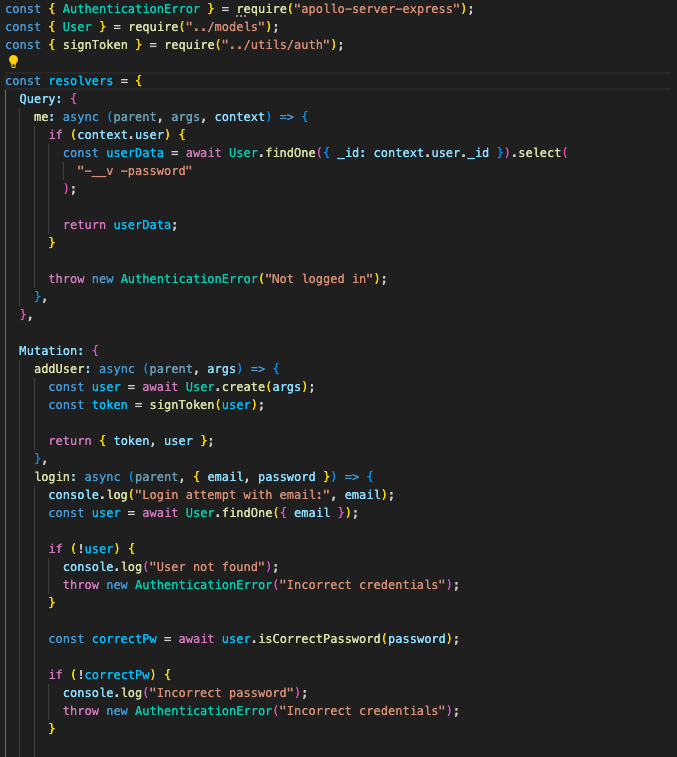
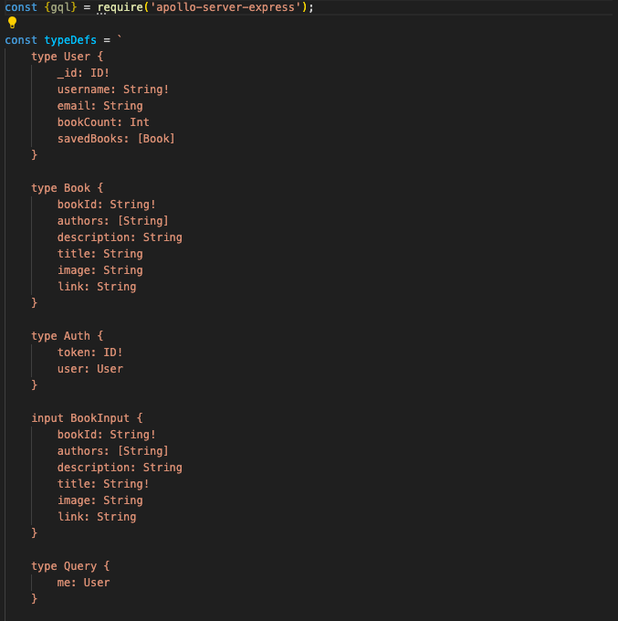
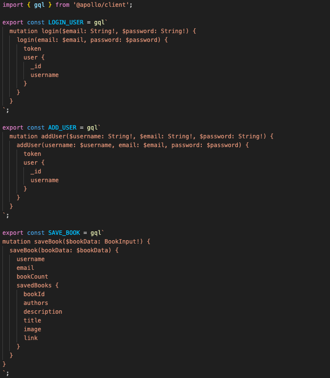
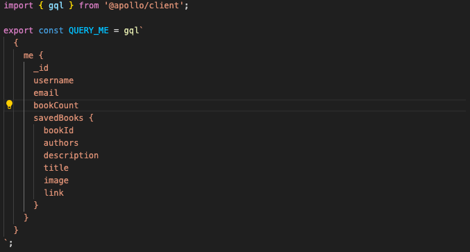

# (⌐⊙_⊙) BOOK SEARCH ENGINE (ʘ言ʘ╬)

### [View Live Project Here](https://janets-react-portfolio.netlify.app/ "BOOK SEARCH ENGINE")<br />

| Technology Used    | Resource URL |
| --------  | ------- |
| NodeJS | https://nodejs.org/en |
| React | https://react.dev/ |
| Vite | https://vitejs.dev/ |
| Apollo Server | https://www.apollographql.com/docs/apollo-server/ |
| GraphQL | https://www.apollographql.com/ |
| JavaScript | https://developer.mozilla.org/en-US/docs/Web/JavaScript |
| Git       | https://git-scm.com/ |
| GitHub     | https://github.com/ |
| VSCode    | https://code.visualstudio.com/ |

## Table of Contents

* [Description](#description)
* [Installation](#installation)
* [Usage](#usage)
* [License](#license)
* [About](#about)

## Description:
This project is a book search engine. Using Apollo/GraphQL to run this application with the React framework.<br />
<br />

### How to use this app:

* Be sure to have the technologies above
* Download this repository to your local device
* Run `npm i`
* Run `npm run develop`
* Visit localhost or the live deployment above
* Navigate through the application to view find books and save them through your own login

  ## User Story

```md
AS AN avid reader
I WANT to search for new books to read
SO THAT I can keep a list of books to purchase
```

## Acceptance Criteria

```md
GIVEN a book search engine
WHEN I load the search engine
THEN I am presented with a menu with the options Search for Books and Login/Signup and an input field to search for books and a submit button
WHEN I click on the Search for Books menu option
THEN I am presented with an input field to search for books and a submit button
WHEN I am not logged in and enter a search term in the input field and click the submit button
THEN I am presented with several search results, each featuring a book’s title, author, description, image, and a link to that book on the Google Books site
WHEN I click on the Login/Signup menu option
THEN a modal appears on the screen with a toggle between the option to log in or sign up
WHEN the toggle is set to Signup
THEN I am presented with three inputs for a username, an email address, and a password, and a signup button
WHEN the toggle is set to Login
THEN I am presented with two inputs for an email address and a password and login button
WHEN I enter a valid email address and create a password and click on the signup button
THEN my user account is created and I am logged in to the site
WHEN I enter my account’s email address and password and click on the login button
THEN I the modal closes and I am logged in to the site
WHEN I am logged in to the site
THEN the menu options change to Search for Books, an option to see my saved books, and Logout
WHEN I am logged in and enter a search term in the input field and click the submit button
THEN I am presented with several search results, each featuring a book’s title, author, description, image, and a link to that book on the Google Books site and a button to save a book to my account
WHEN I click on the Save button on a book
THEN that book’s information is saved to my account
WHEN I click on the option to see my saved books
THEN I am presented with all of the books I have saved to my account, each featuring the book’s title, author, description, image, and a link to that book on the Google Books site and a button to remove a book from my account
WHEN I click on the Remove button on a book
THEN that book is deleted from my saved books list
WHEN I click on the Logout button
THEN I am logged out of the site and presented with a menu with the options Search for Books and Login/Signup and an input field to search for books and a submit button
```

### Lessons Learned 

#### 1. resolvers.js

<br />


#### 2. typeDefs.js

<br />


#### 3. Query

<br />


#### 4. Mutation

<br />



#### Synopsis


## Installation

1. Create a new repository on GitHub, to store this project.
2. Clone the repository to your computer.
3. Copy files to your own repository.
4. Follow the steps for "How to" above
5. Make changes to the code.
6. Commit the changes to the local repo.
7. Push the changes to the remote repo.

## Usage

This project is a book search engine. If you would like to update and use app follow the installation steps and curate it to your needs. If you would like to use this app, follow the steps under the description 'How to' above and click the link at the top of this page.

## License

MIT License
Copyright (c) 2023 Twixmixy / Janet Webster

<hr />

## About
### Janet Webster
Full Stack MERN Software Engineer

- [GitHub](https://github.com/TwixmixyJanet/)
- [LinkedIn](https://www.linkedin.com/in/twixmixy/)
- [Twitter](https://twitter.com/Twixmixy)
- [WakaTime](https://wakatime.com/@Twixmixy)


<br /><br /><br /><br /><br /><br /><br /><br /><br /><br /><br /><br /><br /><br /><br /><br /><br /><br /><br /><br /><br /><br /><br /><br /><br /><br /><br /><br /><br /><br /><br /><br /><br /><br /><br /><br /><br /><br /><br /><br /><br /><br /><br /><br /><br /><br /><br /><br /><br /><br /><br /><br /><br /><br /><br /><br /><br /><br /><br /><br /><br /><br />

Did you really read down this far? Gold star for you! ⭐
```
You have received 5+ points in being EXTRA
```